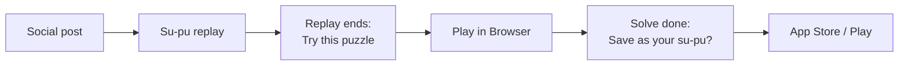

# Su-Pu Launch Campaign

Sep 25, 2026 · @Justin Zhang

## Summary

Run a 4-week "Watch the solve" campaign that uses the two su-pus as free, shareable proof of what Orbace does differently: every solve is replayable, move by move. The easy su-pu pulls in a broad audience learning the basics; the extreme IB Tree su-pu earns credibility and debate among expert solvers. Both point to the website first, and the replay itself becomes the pitch for the app: *"Want your own su-pu? Solve in the app."*

**Goals and KPIs** (baselines needed — fill in current numbers before launch):

| Goal | KPI | 4-week target |
| --- | --- | --- |
| Primary: website visits | Sessions on /su-pu/ pages from campaign UTMs | 3–5x current weekly su-pu traffic |
| Primary: engagement | Replay completion rate; "Play in Browser" clicks | 40%+ watch past midpoint; 15% click Play |
| Secondary: app downloads | Store page visits from site; installs attributed to UTMs | Double the current site-to-store click rate |
| Loop | New user-created su-pus shared | First 25 community su-pus |

**One idea behind every message:** most Sudoku apps show you the answer; Orbace shows you *the thinking*.

## The two su-pus and who they're for

|  | [Easy su-pu (SP-20260924-047554)](https://orbacesudoku.com/su-pu/SP-20260924-047554) | [Extreme su-pu (SP-20260925-683633)](https://orbacesudoku.com/su-pu/SP-20260925-683633) |
| --- | --- | --- |
| Role in funnel | Reach: widest audience, top of funnel | Credibility: earns attention from experts and creators |
| Audience | Casual daily solvers, beginners stuck on "medium," older players in Facebook groups and on Pinterest, parents and teachers | r/sudoku regulars, forum solvers, puzzle YouTubers, competitive players |
| What it shows | Naked single, hidden single and locked candidates used again and again, in a real solve | The Inferential Binary Tree (IB Tree) method cracking an extreme grid |
| Promise | "Learn the 3 moves that solve most puzzles — watch them in action." | "A new, traceable way through an extreme puzzle. Check every step yourself." |
| Best formats | 30–60s vertical video, carousels, Pinterest pins, a "learn" landing page | Long Reddit post, forum thread, 3–5 min explainer video, blog write-up |
| Risk | Looks like every other beginner tip | Experts may call branching "guessing" — go in with the logic, invite scrutiny |

One gap to close first: the su-pu library page currently carries a `noindex` tag. Keep it for private or low-quality replays, but let featured su-pus like these two be indexed so they can rank for technique searches.

## Core messages

Every message leads with curiosity about *how* a puzzle is solved, then offers the replay as the payoff. The app is framed as the way to make your own su-pu, not as a generic download.

| Audience | Hook | Message | CTA |
| --- | --- | --- | --- |
| Beginners stuck at medium | "You only need 3 moves for most puzzles." | Watch a full solve that uses nothing but naked singles, hidden singles and locked candidates. | Watch the replay |
| Daily casual solvers | "What does your solve look like, move by move?" | Orbace records every placement, note and correction — a su-pu you can replay and share. | Try today's free puzzle |
| Expert solvers | "Extreme puzzle, no hand-waving." | The IB Tree lays out every inference in a traceable tree. Pause on any step and check it. | Audit the solve |
| Creators and teachers | "Stop screen-recording. Share a link." | A su-pu is a ready-made, step-by-step lesson you can link or embed. | Make a su-pu in the app |
| Tea-and-puzzle lifestyle | "One puzzle, one tea." | A calm daily ritual with a record of how you thought. | Start your Tea Moment |

**App message (secondary):** "The website lets you watch. The app lets you *keep* — save every solve as a su-pu, play offline, and join the Weekly Cup."

## Channel plan

Start with free, community channels where puzzle solvers already gather; add a small paid test only after you see which message converts. Priority 1 = do in week 1.

| Priority | Channel | Su-pu | Angle | Format | CTA / landing |
| --- | --- | --- | --- | --- | --- |
| 1 | YouTube Shorts, TikTok, Instagram Reels | Easy | "Watch this hidden single" — 15–45s clips cut from the replay, one technique per clip | Screen recording of replay, big captions, voiceover | Link in bio → su-pu with UTM |
| 1 | Facebook Sudoku groups | Easy | Friendly lesson: "here's how locked candidates work" | One key step as an image; link only where group rules allow, otherwise in comments on request | Easy su-pu |
| 1 | YouTube long-form (your channel) | Extreme | "How the IB Tree cracks an extreme Sudoku" | 5–8 min walkthrough using the replay | Extreme su-pu + app |
| 1 | Maker communities: r/SideProject, r/IndieDev, r/iosapps, r/AndroidApps, Show HN | Both | "We built move-by-move replays for Sudoku solves" — the product story, not the puzzle | Post with GIF of a replay; self-promotion is expected there | Su-pu page + app stores |
| 2 | Reddit r/sudoku (no links, no full solves) | Extreme | "Find the next move" challenges from the pivotal IB Tree step; helpful answers on "I'm stuck" posts | Single-step grid image; explain the logic in the post. Link lives only on your profile | Profile → su-pu library |
| 2 | Sudoku forums (e.g. New Sudoku Players' Forum) | Extreme | Method discussion, invite critique | Detailed thread with notation; check link rules first | Extreme su-pu if allowed |
| 2 | Pinterest | Easy | Evergreen tip pins: "Hidden single in 10 seconds" | Tall infographic pins, one per technique | Technique landing page |
| 2 | Puzzle creators and teachers | Both | "Use su-pu links in your videos and lessons" | Short personal email/DM, 10–20 creators | Creator note + app |
| 2 | Email / existing users | Both | "Two new su-pus to watch this week" | Newsletter or in-app message | Su-pus; "make your own" |
| 3 | SEO blog / learn pages | Both | "What is a hidden single?" "Locked candidates explained" "IB Tree method" with embedded replay | Articles | Su-pu + Play in Browser |
| 3 | Apple Search Ads, Google App campaigns | — | Small test ($5–10/day) on terms like "sudoku techniques," "sudoku no ads" | Store listing | App stores |
| 3 | Xiaohongshu / WeChat (optional) | Both | 数谱 and 一局一茶 already speak to Chinese-speaking solvers | Bilingual cards and clips | Su-pu |

**Tease one step, keep the full solve on the site.** Communities like r/sudoku bar commercial links and discourage posting whole solves. So in puzzle communities, share only the single most interesting move, explain it fully, and let the curious find the complete replay through your profile or your own channels. That also makes the site the only place to see the whole solve, which is what drives visits.

In r/sudoku, build standing first: answer help requests for a few weeks with no promotion, then post challenges. Consider messaging the mods once to ask whether a one-time "tool showcase" post would be acceptable.

## Fixing the app download funnel

Low downloads usually come from asking too early or giving no reason. Ask at the moment the visitor has just seen the value: when the replay ends or when they finish a browser puzzle.



The ask at step E is the strongest: "Your solve is ready to become a su-pu. Get the app to save and share it."

1. **End-of-replay card.** When the replay finishes, show "Try this exact puzzle" (browser) and "Save your own su-pu" (app).
2. **Save-your-solve prompt.** After a browser solve, offer to keep it as a su-pu in the app. Deep link so the puzzle opens in the app after install.
3. **Smart app banner** on iOS Safari and a mobile store badge on Android, visible on su-pu pages only for mobile visitors.
4. **QR code on desktop.** Desktop visitors can't install from the page, so show "Scan to continue on your phone."
5. **Store listing.** Make the first screenshot a su-pu replay with the line "Replay every solve, move by move." Record a 20s app preview video from the easy su-pu.
6. **Share previews.** Give each featured su-pu an Open Graph image (grid + technique name) so links look good on Reddit, Facebook and messages.
7. **Reason to return.** Promote the Weekly Cup and daily Tea Moment as app-first habits.

## 4-week timeline

| Week | Focus | Key actions |
| --- | --- | --- |
| Week 0: Sep 28 – Oct 2 | Prep | Add UTMs and analytics events; end-of-replay card; OG images; index featured su-pus; cut 6 short clips; draft posts |
| Week 1: Oct 5 – 9 | Expert launch | Maker-community launch (r/SideProject, Show HN); first 3 shorts from the easy su-pu; start answering r/sudoku help posts |
| Week 2: Oct 12 – 16 | Broad reach | Easy su-pu in Facebook groups; first r/sudoku one-step challenge from the IB Tree solve; 3 more shorts; Pinterest pins; creator outreach |
| Week 3: Oct 19 – 23 | Depth and SEO | Long IB Tree video; 2 technique articles with embedded replays; email to users |
| Week 4: Oct 26 – 30 | Optimize | Double down on the best channel and message; start $5–10/day search ads test; invite users to share their own su-pus |

Publish a new featured su-pu each week after launch so every channel has something fresh to post.

## Measurement

Tag every link so you can tell which channel and which su-pu drove visits and installs.

- **UTM format:** `?utm_source=reddit&utm_medium=social&utm_campaign=supu_launch&utm_content=ibtree` (swap source and content per post).
- **Site events:** replay started, replay 50% / 100%, Play in Browser click, browser puzzle completed, store badge click, QR shown.
- **App side:** App Store Connect campaign links (`pt` and `ct` parameters) and Google Play install referrer, so installs map back to the campaign.
- **Weekly review:** visits, replay completion and store-click rate by channel; cut the weakest channel and shift effort to the strongest.

Open question: current weekly su-pu visits and site-to-store click rate, so the targets in the summary can be set as real numbers.

## Ready-to-post copy

**Reddit r/sudoku — one-step challenge (no link, no full solve)**

> **Title:** Extreme puzzle, one pivotal step: can you find why r4c6 can't be 7? \[Image: grid at the turning point, key candidates highlighted\]
>
> This is the moment an extreme puzzle broke open for me. I got there with what I call the IB Tree: branch on a strong link, follow the inferences on both sides, keep what both branches agree on.
>
> Is there a cleaner single-chain route? I'll post my full reasoning in the comments tomorrow. (Swap in the real cell and digit from the su-pu; no link in the post.)

**Maker communities (r/SideProject, Show HN) — product story**

> **Title:** We built move-by-move replays for Sudoku solves
>
> Most puzzle apps show the finished grid. We wanted to capture how someone *thinks* through one — every placement, note and correction — as a replay you can share by link. Here's an extreme solve and an easy one: \[links\]. Feedback on the replay player very welcome.

**Facebook groups — easy su-pu (link only where allowed)**

> A whole puzzle solved with only three techniques: naked single, hidden single and locked candidates. If you're stuck moving from easy to medium, watch how often each one shows up. Replay here: \[link\]

**Short video (30–45s) — easy su-pu**

- 0–3s: "Most Sudoku puzzles need just 3 moves. Here's the one people miss."
- 3–25s: replay of one hidden single, circled and slowed down, caption names the technique.
- 25–35s: quick montage of the rest of the solve at 4x speed.
- 35–45s: "Watch the full solve, free — link in bio."

**Pinterest pin**

> Headline: "Hidden Single: the Sudoku move you're missing" — Subtext: "See it in a real solve, step by step" — link to the easy su-pu.

**Creator outreach DM**

> Hi \[name\] — I make Orbace Sudoku. We built su-pu: shareable, move-by-move replays of a solve. Here's one of an extreme puzzle: \[link\]. If it's useful for your videos or students, I'd be glad to set you up with featured su-pus of your own solves. No strings.

**Email subject lines**

- "Watch an extreme Sudoku get solved, one move at a time"
- "The 3 moves behind most Sudoku puzzles"
- "Your solves can be replayed now"

## YouTube video prompt 1: easy su-pu

Paste this into an AI writing assistant along with the su-pu's move list (or screenshots of key steps). It returns a full script, shot list and upload package; you record the replay on screen and add voiceover.

```markdown
You are a scriptwriter and YouTube strategist for Orbace Sudoku, a calm, thoughtful Sudoku app (tagline: "One puzzle, one tea"). Write a complete YouTube video package.

VIDEO GOAL
Get viewers to click the su-pu link to watch the full move-by-move replay on our website. App download is a secondary ask at the very end.

SOURCE MATERIAL
- Su-pu replay: https://orbacesudoku.com/su-pu/SP-20260924-047554?utm_source=youtube&utm_medium=video&utm_campaign=supu_launch&utm_content=easy
- Puzzle level: Easy
- Techniques used: naked single, hidden single, locked candidates (pointing and claiming)
- Move list / key moments: [PASTE MOVE LIST OR DESCRIBE 6-8 KEY STEPS WITH CELLS]

AUDIENCE
Casual solvers who can finish easy puzzles but stall on medium. Many are 35-70, solve daily, and have never heard the technique names.

FORMAT
- Length: 6-8 minutes, 16:9, screen recording of the su-pu replay with voiceover.
- Tone: warm, patient, unhurried. No hype, no jargon without an immediate plain-English definition.

STRUCTURE (with timestamps)
1. Hook (0:00-0:20): promise "Three moves solve most Sudoku puzzles. By the end you'll spot all three." Show the finished grid for one second.
2. Setup (0:20-0:50): show the starting grid; explain what a su-pu is in one sentence (a move-by-move replay of a real solve).
3. Technique 1 - Naked single: define it, show the first real example from the replay, then 2 quick repeats at faster speed.
4. Technique 2 - Hidden single: same pattern. Include one "pause and find it yourself" moment with a 3-second countdown.
5. Technique 3 - Locked candidates: explain pointing and claiming with highlighted boxes; show the elimination it unlocks.
6. Montage: the rest of the solve at 4x, with the technique name flashing on each move.
7. Recap (15s): the three moves on one screen.
8. CTA (last 30s): "Watch every move of this solve at your own pace - link in the description and pinned comment." Then: "Want a replay of your own solves? The Orbace app saves each one as a su-pu."

DELIVERABLES
1. Full voiceover script with timestamps.
2. Shot list: for each segment, what is on screen, which cells to highlight, zoom level, on-screen text (max 6 words).
3. Three title options (under 60 characters, searchable - include "Sudoku" and a technique name).
4. Description: first two lines contain the su-pu link and a reason to click; then chapters matching the timestamps; then app links (iOS: https://apps.apple.com/us/app/orbace-sudoku-free/id6782447247, Android: https://play.google.com/store/apps/details?id=com.orbace.mobile).
5. Pinned comment text with the su-pu link and a question to drive replies.
6. Thumbnail concept: grid close-up, one highlighted cell, 3-4 words of text.
7. Three YouTube Shorts cut-downs (under 45s each), one per technique, each ending with "Full solve: link in the video description."
8. End screen: which elements to show in the last 20s.

RULES
- Every technique claim must match a real move in the replay; do not invent moves.
- Use cell notation r#c# (row, column) on screen.
- Mention the su-pu link at least twice in the voiceover (after technique 2 and at the end).
```

## YouTube video prompt 2: extreme su-pu (IB Tree)

Same workflow. Paste your own definition of the IB Tree where marked so the script doesn't guess at the method.

```markdown
You are a scriptwriter and YouTube strategist for Orbace Sudoku, a thoughtful Sudoku app that records every solve as a su-pu (a move-by-move replay). Write a complete YouTube video package.

VIDEO GOAL
Get expert solvers to click the su-pu link and check the full IB Tree solve on our website. Secondary: earn credibility and comments from the expert community. App download is a light ask at the end.

SOURCE MATERIAL
- Su-pu replay: https://orbacesudoku.com/su-pu/SP-20260925-683633?utm_source=youtube&utm_medium=video&utm_campaign=supu_launch&utm_content=ibtree
- Puzzle level: Extreme
- Method: Inferential Binary Tree (IB Tree). Our definition: [PASTE YOUR 2-3 SENTENCE DEFINITION AND HOW IT DIFFERS FROM TRIAL-AND-ERROR]
- Key moments: [PASTE: where basic techniques stall, the branch cell/digits chosen, what each branch implies, the eliminations or placements both branches agree on, and how the puzzle finishes]

AUDIENCE
Experienced solvers who know X-Wing, chains and AICs. They are skeptical of anything that looks like guessing and will check every step.

FORMAT
- Length: 10-14 minutes, 16:9, su-pu replay on screen plus a simple animated tree diagram beside the grid.
- Tone: precise, calm, confident; invite scrutiny rather than overclaiming.

STRUCTURE (with timestamps)
1. Cold open (0:00-0:30): show the stuck grid. "Standard techniques stop here. Here's a structured way through - and every step is on the record."
2. The stuck point (0:30-2:00): fast-forward the easy phase; show why common techniques run out.
3. What the IB Tree is (2:00-3:30): define it using our definition only; address the "isn't this guessing?" objection head-on.
4. The tree, step by step (3:30-9:00): pick the branch point, follow branch A, follow branch B, draw the tree growing on screen; highlight the conclusions both branches share and why they are forced.
5. The breakthrough (9:00-10:30): apply the result and show how the puzzle collapses.
6. Finish (10:30-11:30): rest of the solve at 4x.
7. Challenge + CTA (last 60s): "Pause on any step in the full replay - link in the description. If you find a shorter route, post it in the comments." Then: "The Orbace app records your own solves as su-pus."

DELIVERABLES
1. Full voiceover script with timestamps.
2. Shot list with cell highlights (r#c# notation), candidate colors, and when the tree diagram updates.
3. Tree diagram spec: node labels and layout for each stage, so a designer can animate it.
4. Three title options (under 60 characters; include "Extreme Sudoku" and a curiosity hook).
5. Description: su-pu link in the first line with "check every step"; chapters; short IB Tree definition; app links (iOS: https://apps.apple.com/us/app/orbace-sudoku-free/id6782447247, Android: https://play.google.com/store/apps/details?id=com.orbace.mobile).
6. Pinned comment asking viewers to find a shorter path, with the su-pu link.
7. Thumbnail concept: grid with a glowing tree branching off one cell, 3-4 words.
8. Two Shorts (under 60s): "The moment this extreme puzzle broke" and "Is this guessing? 45-second answer", each pointing to the full replay.

RULES
- Never describe the IB Tree beyond our definition; flag anything you are unsure of as [CHECK].
- Every deduction must match the replay; do not invent moves.
- Do not call competing methods wrong; compare respectfully.
```

For both videos, record the su-pu replay itself on screen. It shows the product in action and makes the link feel like "see the rest" rather than an ad.

## YouTube ads: options, targeting and budget

**Recommendation:** publish both videos organically first, then put about $20/day into a **Demand Gen campaign optimized for website visits**, spending most of it on the easy video. For a hobby audience, it's the cheapest way to buy clicks to the su-pu pages. Use video-view campaigns only to put the extreme video in front of Sudoku channels' viewers, and wait on app-install campaigns until the store listing is fixed.

| Option | What it buys | Typical cost (2026 benchmarks) | Fit for su-pu clicks | Verdict |
| --- | --- | --- | --- | --- |
| Organic (SEO titles, pinned comment, Shorts) | Search and suggested views | $0 | Good long-term; slow start | Do first, always |
| Demand Gen (goal: website visits) | Clicks from in-feed, Shorts and in-stream placements | In-feed CPM $3–8, CTR 1–3% → est. $0.15–$0.80 per click | Best: optimizes directly for clicks to the site | **Main paid channel** |
| Video views campaign (skippable in-stream / in-feed) | Views; lets you pick specific channels and videos to appear on | CPV $0.01–$0.10; CTR 0.5–2% | Builds channel views; fewer site clicks per dollar | Small budget, extreme video on Sudoku channels |
| Shorts ads | Cheap reach on mobile | CPM \~ $4; CTR 0.1–0.5% | Weak for clicks | Skip for paid; use Shorts organically |
| Bumper / non-skippable | Awareness | CTR < 0.3% | Poor | Skip |
| App campaign (App promotion) | Installs across Google, including YouTube | Varies by market | Useful once the store page converts | Later, $10/day test |

Per-click costs are estimated from CPM ÷ (1,000 × CTR) using the benchmarks below. Expect puzzle and hobby audiences near the low end, since they draw little ad competition.

**Targeting**

|  | Easy video | Extreme video |
| --- | --- | --- |
| Custom segment (people who searched) | "how to solve sudoku," "sudoku tips," "sudoku for beginners," "hidden single" | "x wing sudoku," "sudoku chains," "hardest sudoku," "sudoku solving techniques advanced" |
| Interests | Puzzles and brain games; casual mobile games; crosswords and word games | Puzzles and brain games; logic and strategy games |
| Placements (video views campaign only) | Beginner Sudoku tutorial videos | Expert Sudoku channels and their advanced-technique videos |
| Age | 35+ (test 25–34 separately) | 25+ |
| Geography | US, Canada, UK, Australia to start | Same |
| Landing | Easy su-pu with UTM `utm_content=easy_ad` | Extreme su-pu with `utm_content=ibtree_ad` |

**Budget options (4 weeks)**

| Plan | Daily spend | Split | Est. su-pu visits from ads |
| --- | --- | --- | --- |
| Lean test | $10 | Demand Gen only: 70% easy / 30% extreme | 350–1,800 |
| **Standard (recommended)** | $20 | $15 Demand Gen (easy-heavy) + $5 video views on Sudoku channels (extreme) | 550–3,000 |
| Growth | $50 | $35 Demand Gen + $5 video views + $10 App campaign once the store listing is updated | 1,250–6,700 (plus installs) |

**How to run it**

1. Week 1: publish both videos with the su-pu link as the first line of the description and in a pinned comment. Cut 3–5 Shorts and use each Short's related-video link to point to its full video.
2. Before spending: install the Google tag on orbacesudoku.com and set "replay started" on a su-pu page as the conversion Demand Gen optimizes for.
3. Weeks 2–3: run the Standard plan with 2 thumbnails and 2 opening hooks per video. Pause any ad under 0.8% CTR after 1,000 impressions.
4. Week 4: move budget to the best video and audience; judge on cost per replay started, not views.

Note: clickable end-screen links to your own website require the YouTube Partner Program. Until then, the description link and pinned comment carry the clicks, so each script mentions the link out loud.

Sources (opened Sep 25, 2026): [Store Growers — YouTube Ads Benchmarks 2026](https://www.storegrowers.com/youtube-ads-benchmarks/) · [AdWave — YouTube Ad Costs 2026](https://adwave.com/resources/youtube-ad-costs). Benchmarks are industry estimates, not Google rates.
