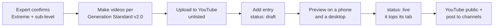

# Su-Pu Showcase: Enhancement Plan

Sep 29, 2026 · @Justin Zhang

## Summary

Launch a separate **Extreme Showcase** page at `orbacesudoku.com/showcase`, with its own "Showcase" item in the site menu. It is not part of `/su-pu`; the library links to it with one strip. Every video, ad, Reddit post and QR code points here or to a su-pu on it, so it becomes the anchor for all video marketing.

The page is **mobile-first**: 90% of the people arriving from marketing videos are on phones, so the phone layout is the primary design and desktop is the adaptation. It detects the screen and serves the matching video format (9:16 on a phone held upright, 16:9 elsewhere), and the visitor can switch.

Content is Extreme only, in **three tabs** instead of stacked sections: **Full replays**, **Journal lessons** (the 8 lessons, each linked to its su-pu) and **Trailers**. Easy and other levels stay in the regular su-pu library. Videos follow the [Orbace Video Generation Standard v2.0](https://claude.ai/code/artifact/4d9e7545-110b-4822-a92f-d2a34d655ddd): three types, and three formats (16:9, 9:16, and 1:1 for trailers only).

The page is driven by one manifest, so a new video is one new entry, and the newest (or a pinned featured) item rises to the top on its own. Launch content: the 136-step full replay (SP-20260928-355762), the IB Tree trailer (SP-20260925-683633) and Lessons 01–08 (Lesson 07 with video).

Difficulty is set by Orbace's Sudoku expert: **Extreme** is the top level, with expert-assigned sub-levels such as **Hell**. The mockup marks Hell where the Journal already tags a lesson "Hell-tier" (Lessons 03–06) and where your IB Tree cover calls the puzzle Hell-level; everything else shows plain Extreme until the expert assigns it.

## Current /su-pu page

The library works as a search tool, but it cannot sell a replay: there is no video, and the cards hide each su-pu's story. Checked on the live page today.

| What exists | Gap for video marketing |
| --- | --- |
| Hero: "A finished grid shows the answer. Su-Pu shows the journey." + counts (120 public, 39 clean) | No video or moving demo; the promise is told, not shown |
| Search with difficulty, technique, type and sort filters | No "has video" filter; technique list omits IB Tree and locked candidates |
| Featured Su-Pu (3 cards) | Two of the three cards open the same su-pu (SP-20260913-664096) |
| Public Su-Pu grid (120 cards) | Every recent card reads "unrated solve · Anonymous · 00:00 · Puzzle Score 0"; the story title (e.g. "Using ibtree to identify a quick contradiction") is not shown |
| Watch counts per card | Useful proof: SP-20260924-047554 has 231 watches, SP-20260925-683633 has 145 |
| Indexed (`index, follow`), canonical /su-pu | Good; the showcase page needs the same, plus video markup |

The card fix (show the story title, difficulty and technique instead of "unrated solve") helps the whole library, not just the showcase, and should ship first.

## New page: structure and UI

The [Su-Pu Showcase mockup](https://claude.ai/artifact/HmCJC21KFhTxww6w3T4ZX6) now has two boards: **phone (390 wide, primary)** and **desktop (1440 wide)**. Tabs, the format toggle and the player work in the mockup, and every card comes from one data list, the same way the live page will.

| Part | Phone (primary) | Desktop |
| --- | --- | --- |
| Header | Logo + menu button | Logo, site nav with **Showcase** active, "Get the app" |
| Hero | Featured video as a tall 9:16 player (300 wide), badge LATEST or FEATURED, title, "Watch the complete replay" | 16:9 player (832 wide) beside the headline and the same CTA |
| Format toggle | "Vertical 9:16 / Landscape 16:9" under the hero; defaults from the screen | None needed; desktop always gets 16:9 |
| Tabs | Full replays · Lessons · Trailers, each with a count; full-width, 52 px tall for thumbs | Same three tabs, left-aligned |
| Full replays / Trailers tab | 2-column grid of 9:16 posters, newest first, plus a dashed "Next …" slot | 3-column grid of 16:9 posters |
| Lessons tab | 8 rows: grid image, lesson number, level, Video / "Video soon" tag, Read + Replay → | Same rows in 2 columns |
| Player | Full-screen sheet, 9:16, with "Watch the complete replay" under it | Dimmed overlay with a 16:9 player |
| After the tabs | "Record your own su-pu" app card, then "Browse the Su-Pu library" for gentler solves | Same |

The tabs replace the old filter bar, counters and Shorts row: on a phone, stacked sections pushed lessons and trailers several screens down, and the vertical cuts now play in the main player rather than a separate row.

**On `/su-pu`:** replace the three Featured cards with one "Extreme showcase" strip (latest video + "See the showcase →" to `/showcase`). **On each showcased `/su-pu/<id>` page:** add the video above the replay player, collapsed to a poster, so a visitor from YouTube sees the same video and then the live replay.

Videos play through YouTube embeds (click-to-load, so the page stays fast on mobile data); the 4K files stay the masters on YouTube, not on your server.

### Serving the right format

| Screen | Served | How it is decided |
| --- | --- | --- |
| Phone, upright | 9:16 | `matchMedia('(orientation: portrait) and (max-width: 767px)')` |
| Phone sideways, tablet, desktop | 16:9 | Everything else |
| Ads and social feeds | 1:1 (trailers) | Not on the page; uploaded to Google Ads and feeds only |

- Decide by screen shape, not by user-agent sniffing: it also works in the Reddit, Instagram and YouTube in-app browsers, and a phone turned sideways gets 16:9.
- Choose the format when the player opens; never swap a video that is already playing.
- Posters use `<picture>` with a `media` query per aspect, so a phone downloads only the 9:16 image.
- If an entry has only one format, play that one (letterboxed) rather than hiding the entry.
- A tap on the format toggle overrides the automatic choice and is remembered on that device.
- A link can force the format: `/showcase?v=SP-20260928-355762&fmt=916` (used in Shorts descriptions).

## Data model: the showcase manifest

One record per showcase entry drives the whole page. Every entry points to a su-pu, so every card has a replay link. Store it as a `showcase_entries` table (or a JSON file for the first release) and serve it from `GET /api/showcase`.

| Field | Example | Notes |
| --- | --- | --- |
| `type` | full\_replay / lesson / trailer | Decides the tab |
| `supu_id` | SP-20260928-355762 | Lessons: the su-pu the lesson rebuilds |
| `title`, `hook` | Identifying a quick contradiction… / What if r5c3 = 1? | Su-pu story title, or the lesson title |
| `level`, `sub_level` | Extreme, Hell | **Expert-assigned.** Only Extreme appears; sub-level from a managed list |
| `lesson` | `{number: 7, path}` | Lessons only |
| `videos` | list of `{aspect, youtube_id, duration_s, poster}` | One per format: `16:9` and `9:16` required, `1:1` for trailers. Empty list on a lesson = "Video soon" |
| `published_at`, `status` | 2026-09-28, live | draft / live / hidden |
| `featured_until` | 2026-10-12 | Optional. Pins the entry to the hero until that date |
| `pin_in_tab` | false | Optional. Holds the entry at the top of its tab |

```json
[
  {
    "type": "full_replay",
    "supu_id": "SP-20260928-355762",
    "title": "Identifying a quick contradiction to pinpoint a critical digit",
    "hook": "What if r5c3 = 1?",
    "level": "Extreme", "sub_level": null,
    "videos": [
      {"aspect": "16:9", "youtube_id": "[YOUTUBE_ID]", "duration_s": 140, "poster": "SP-20260928-355762_full_169.jpg"},
      {"aspect": "9:16", "youtube_id": "[SHORTS_ID]", "duration_s": 140, "poster": "SP-20260928-355762_full_916.jpg"}
    ],
    "published_at": "2026-09-28", "status": "live", "featured_until": null
  },
  {
    "type": "trailer",
    "supu_id": "SP-20260925-683633",
    "title": "Using ibtree to identify a quick contradiction",
    "level": "Extreme", "sub_level": "Hell",
    "videos": [
      {"aspect": "16:9", "youtube_id": "[ID]", "duration_s": 43},
      {"aspect": "9:16", "youtube_id": "[ID]", "duration_s": 43},
      {"aspect": "1:1", "youtube_id": "[ID]", "duration_s": 43}
    ],
    "published_at": "2026-09-25", "status": "live"
  },
  {
    "type": "lesson",
    "supu_id": "SP-20260729-981927",
    "title": "Taming the ‘Hell’ Puzzle: One Fork, Seven Minutes",
    "level": "Extreme", "sub_level": "Hell",
    "lesson": {"number": 4, "path": "/journal/taming-the-hell-puzzle"},
    "videos": [],
    "published_at": "2026-07-28", "status": "live"
  }
]
```

The page never shows the 1:1 file; it is stored so the ads team and the page share one record per video.

## Operations: adding content and choosing what is on top

### Adding a new video

Every new entry follows the same steps. Only steps 4–5 touch the site, and they are a data change, not a release.



1. **Confirm the level.** The Sudoku expert marks the su-pu Extreme and sets a sub-level if any. Anything below Extreme goes to the regular library instead.
2. **Make the videos** to the [Video Generation Standard v2.0](https://claude.ai/code/artifact/4d9e7545-110b-4822-a92f-d2a34d655ddd): 16:9 and 9:16 for every type, plus 1:1 for trailers. File names `<supu-id>_<type>_<format>_4k.mp4`, posters the same with `.jpg`.
3. **Upload unlisted** to YouTube with title, description and a UTM link to `/su-pu/<id>`.
4. **Add the entry** in the admin (or the JSON file) with `status: draft`: type, su-pu, title, hook, level, one `videos` item per format.
5. **Preview** at `/showcase?preview=1` on a phone (9:16 plays) and a desktop (16:9 plays), then set `status: live`.
6. **Publish** the YouTube videos and post to channels. A new lesson video goes on the lesson's existing entry, which switches from "Video soon" to "Video".

### What goes on top

| Place | Rule |
| --- | --- |
| Hero | The live entry with the latest `featured_until` still in the future (badge FEATURED). If none, the newest live entry with a video, any type (badge LATEST) |
| Featured expiry | When `featured_until` passes, the hero falls back to the newest entry on its own; nobody has to unpin it |
| Full replays and Trailers tabs | Newest `published_at` first; `pin_in_tab` entries above the rest |
| Lessons tab | Highest lesson number first, so a new lesson lands on top; lessons with video show a play button |
| Default tab on arrival | The tab of the hero entry; a link can open another: `/showcase?tab=trailers` |
| NEW badge | On cards published in the last 7 days |

In practice: publishing a video makes it the LATEST hero with no extra step. Set `featured_until` only to hold something older in the hero, for example during an ad campaign for that trailer (two weeks is a sensible default). The hero entry's card stays in its tab as well.

## SEO, sharing and tracking

| Area | What to add |
| --- | --- |
| Page | Title "Su-Pu Showcase: Extreme Sudoku Solves, Move by Move \| Orbace Sudoku"; `index, follow`; canonical `/showcase` |
| Video markup | `VideoObject` structured data per video (name, description, thumbnail, upload date, duration, embed URL) so videos can appear in Google video results |
| Share previews | Open Graph image per entry (the 1280×720 thumbnail); the page's own OG image = the latest entry |
| Deep links | `/showcase?v=SP-20260928-355762` opens the page with that video in the hero, for posts that should land on the showcase rather than the replay |
| Events | `showcase_video_play`, `showcase_replay_open`, `showcase_tab, showcase_format (auto vs toggled)`, plus the existing `replay_start` and `store_click` |
| Funnel to watch | Showcase visits → video plays → replay opens → replay starts → store clicks, split by `utm_source` |

Once the card fix ships, each su-pu page's title and description should use its story title too, so search results show "Identifying a quick contradiction…" instead of "unrated solve".

## Build phases

| Phase | Scope | Owner | Done when |
| --- | --- | --- | --- |
| 1. Card fix | Library cards show story title, difficulty, technique; dedupe Featured | Team Web | No "unrated solve" cards for su-pus that have a story |
| 2. Showcase v1 | `/showcase` as its own page, phone layout first; hero, three tabs, format detection + toggle, player sheet; JSON manifest; YouTube click-to-load embeds | Team Web | 2 videos + 8 lessons live; 9:16 plays on an upright phone; adding one = one JSON entry |
| 3. Wiring | Showcase strip on `/su-pu`; video block on each showcased su-pu page; VideoObject + OG; the events above | Team Web + Team A (API) | Events visible in GA4; rich results test passes |
| 4. Admin | `showcase_entries` table + editor fields (type, expert level/sub-level, hook, videos per format, featured\_until, pin\_in\_tab) | Team A | An editor adds an entry without a deploy |
| 5. Growth | Email signup for "new every week", "has video" filter in the library, Chinese copy | Team Web | Signup form live |

**Lesson video regeneration.** All eight studies get new 4K videos from the same pipeline as the full replay (real replay capture, r1–r9 / c1–c9 labels, "Entry" wording, callouts from the lesson's own notes). One check first: the lesson su-pus are stored in the older move format (a `moves` list, not the newer capture log), so confirm the replay page renders them with the new labels before the batch run. Each regenerated video replaces its entry's `youtube_id`; the showcase updates on its own.

Open questions:

- [x] Scope: Extreme only — videos (trailers, full replays) and Journal studies; Easy goes to the regular library
- [x] Difficulty: set by the Sudoku expert; Extreme is the top level, with sub-levels such as Hell
- [x] Page: separate `/showcase`, mobile-first, three tabs (Full replays, Journal lessons, Trailers)
- [x] Formats: 16:9 and 9:16 for every video; 1:1 for trailers only, for Google Ads and social feeds (+\~35% render time per trailer; see the Generation Standard's square assessment)
- [ ] Lesson video: Lesson 07 (SP-20260801-567421, 125 steps) has "Su-Pu Replay #002" (youtu.be/fk18qqlLIPU, 1:15); it is in the mockup and will be replaced when the lessons are regenerated
- [ ] Sub-level list: which names besides Hell (the filter builds its chips from whatever the expert uses)
- [ ] YouTube IDs for the two launch videos once uploaded
