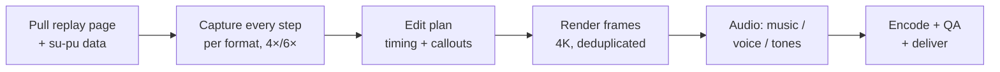

# Orbace Video Generation Standard v2.0

Sep 30, 2026 · @Justin Zhang

## Summary

This standard governs every Orbace video made from a Su-Pu replay: **three types** (full replays, Journal lessons, marketing trailers) in **three formats** (16:9 landscape, 9:16 vertical, 1:1 square). It merges the Replay Trailer Standard v1.0 and the Trailer V6 revision notes with the production process proven on the SP-20260928-355762 full replay.

What changes from the earlier documents:

| Topic | Before | Now |
| --- | --- | --- |
| Master format | 9:16 master, 16:9 cropped from it (v1.0) | Each format rendered from its **own capture** of the replay page; cropping a 9:16 master to 16:9 keeps only a third of the height and cuts the grid |
| Formats | 9:16 + 16:9 | 9:16 + 16:9 for every video; **1:1** for trailers (ads and social feeds) |
| Resolution | 1080p | **4K masters** (3840×2160, 2160×3840, 2160×2160); small replay text stays sharp after YouTube compression |
| Types | Trailer only | Full replay, Journal lesson, Trailer, each with its own structure |
| Captions | White with shadow | Dark ink on the cream band; white is unreadable on the Su-Pu interface |
| QR / links | QR on 16:9; short redirect preferred (`/r/<slug>`) | QR on 16:9 only, canonical su-pu URL; branded redirects (`/go/<slug>`) are optional future infrastructure, never a blocker |
| Coordinates | — | r1–r9 / c1–c9 labels always visible, enlarged for video legibility |

Scope reflects the audience: about 90% of marketing viewers watch on phones, so **9:16 is the primary format** and is reviewed first.

## Principles (inherited from Trailer Standard v1.0)

**The replay is the product. The trailer is the door. Replay the thinking.** Every video preserves human reasoning, not just a finished board.

- **Fidelity:** genuine replay footage only. Never fabricate UI, moves, techniques, chapters, coordinates or events. If a beat has no real footage, delete the beat.
- **Market the replay, not the technique.** Techniques appear as the replay labels them; the video never teaches them in narration.
- **Allowed motion:** freezes, speed changes, scrubbing with the real replay controls, cropping, one slow push per scene. No fake overlays, shakes, whips, risers or impacts.
- **Endings:** trailers end on an invitation to the replay, never the solved board. Full replays and lessons may show the solve (that is their job) but still end on the invitation.
- **Vocabulary:** Replay, Timeline, Turning Point, Chapter, Decision, Technique, Story. Primary CTA **"Watch the complete replay."** Brand line **"Replay the thinking."**
- **Emotional profiles by level:** Easy = Recognition → Confidence → Insight → Understanding; Extreme = Curiosity → Tension → Contradiction → Breakthrough; Journal = Reflection. Medium, Hard, Competition and Community profiles follow v1.0.
- **Governance:** type- and level-specific briefs inherit this standard and override only emotional arc, hook, music profile, turning-point treatment and timing.

## The three video types

|  | Full replay | Journal lesson | Marketing trailer |
| --- | --- | --- | --- |
| Job | Show the whole solve, every step | Pair a Journal study with its replay | Stop the scroll and send people to the replay |
| Reference | SP-20260928-355762 (2:20, 136 steps) | Lesson 07, Su-Pu Replay #002 (1:15, 125 events) | IB Tree V6 (0:43), Easy V4 (0:38) |
| Length | 1:30–3:00 (Shorts limit 3:00) | 1:00–2:30 | 0:30–0:50 |
| Shows the solved board | Yes | Yes | **Never** |
| Voice | None | None (optional later, Reflection tone) | Warm documentary narrator, synthetic, \~125–130 wpm |
| Sound | Soft pad + one tone per placed digit (pitch by digit), chime on key callouts, resolving chord at the solve | Same as full replay, slower | Minimal music on the level's arc; true silence at the turning point |
| On-screen text | Callouts from the solver's own notes; technique labels as brief tags | Lesson title, question, the lesson's key moments as callouts | Narration captions only |
| Formats | 16:9 + 9:16 | 16:9 + 9:16 | 16:9 + 9:16 + 1:1 |

### Full replay: structure

1. **Intro card (≈4.5 s):** brand mark, "Full step-by-step replay", su-pu title, opening question, one fact line ("136 steps · one test · one contradiction").
2. **Starting grid hold (1.2 s).**
3. **Every step in order, paced by event type:** placement 0.8 s, pencil mark 0.3 s, pin 0.8 s, test opens 1.8 s, test move 0.9 s, test closes 1.8 s, technique label 1.2 s, key note 2.8 s.
4. **Callouts** in the caption band: the solver's key notes verbatim with the key phrase highlighted ("Conflict — **proof by contradiction**"). Derived callouts only when they restate a recorded event exactly ("What if **r5c3 = 1**?" from a test on r5c3 = 1).
5. **Solved hold (3.5 s):** "Solved in **N steps**".
6. **End card (8 s):** takeaway from the su-pu story, "Replay it at your own pace", link (QR on 16:9).

### Journal lesson: structure

1. **Title card (≈5 s):** "Journal · Lesson NN", lesson title, the lesson's question.
2. **Replay of the lesson's su-pu**, full replay pacing, but the lesson's key moments (fork, branch, proof) get 1.5× holds and callouts quoted from the lesson text.
3. **Chapter cards** wherever the lesson has sections, held 0.5 s longer than natural (from V6).
4. **End card:** "Read the full study" + "Watch the complete replay", both links (QR on 16:9).

### Marketing trailer: structure (Story Framework v1.0 + V6)

1. **Hook (0–2 s):** open on the best moment; a viewer-centred line (Extreme: "This puzzle looked impossible." → "Until this happened…").
2. **Context:** the real branch or pattern forming before the turning point, so the turning point feels earned.
3. **Turning point:** freeze; 1.0 s true silence; one short line.
4. **Rewind:** "Let's replay it." → scrub back with the real Back control.
5. **Replay begins:** accelerated, chapter titles held +0.5 s.
6. **Replay resumes:** freeze at \~60–65%; never the solved board.
7. **Invitation + end card:** "Watch the complete replay" / "Replay the thinking."

## The three formats

Every format is its own render from its own capture of the live replay page — never a crop of another format.

|  | Vertical 9:16 (primary) | Landscape 16:9 | Square 1:1 |
| --- | --- | --- | --- |
| Master | 2160×3840, 30 fps | 3840×2160, 30 fps | 2160×2160, 30 fps |
| Capture | Phone layout, 390 px wide viewport at 6× density | Desktop layout, 1280 px viewport at 4× density | Desktop layout at 4×, grid + current move only (see assessment) |
| Composition | Caption band on top (top 16% of frame); grid, controls, step counter and move list stacked below; bottom 20% kept clear for platform buttons | Caption band on top (14%); grid and move list side by side | Caption band on top (12%); grid centred; one-line "current move" strip and step counter below |
| End card | Link as text, split over two lines; **no QR** | Link + **QR** (scan-tested at full and half size) | Link as text; no QR |
| Served on | YouTube Shorts, Instagram Reels, TikTok, Facebook Reels, and the showcase page on phones | YouTube long-form, the showcase page on desktop and tablets, presentations, LinkedIn | Google Ads (Demand Gen, in-feed), Facebook / Instagram / LinkedIn feeds, Google Display |
| Made for | Every video | Every video | Trailers (and full-replay cut-downs if ads need them) |

Text sizes at 4K master (halve for 1080p): key callout 100–108 px, technique tag 76–84 px, r/c labels ≥ 46 px on the final frame. Coordinate labels are enlarged and darkened for capture (16 px desktop / 13 px phone, weight 600) — same labels, same positions.

## Square (1:1) assessment

**Recommendation: add square for trailers only, starting with the next paid campaign; skip it for full replays and lessons.** Square is the one format Google lists for almost every Demand Gen placement, but it matters for ads and social feeds, not for the showcase page or YouTube organic.

Google's Demand Gen video spec lists four orientations — 16:9 (1920×1080), 1:1 (1080×1080), 4:5 (1080×1350) and 9:16 (1080×1920) — and names square and horizontal for YouTube Shorts, Home, Search, Watch Next, in-stream, Discover, Gmail and the Display Network, with 9:16 recommended for Shorts; it allows 1–5 videos per ad ([Google Ads Help](https://support.google.com/google-ads/answer/17141078?hl=en)).

| Impact area | What it means for Orbace | Size |
| --- | --- | --- |
| Reach in paid campaigns | Discover, Gmail and feed placements favour square; without it those slots fall back to letterboxed 16:9 | Medium benefit |
| Organic YouTube | No gain: Shorts want 9:16, long-form wants 16:9 | None |
| Showcase page | Not needed; phones get 9:16, desktop gets 16:9 | None |
| Layout work | New composition: the move list does not fit beside or below the grid in a square, so it becomes a one-line "current move" strip | One-time, \~1 day |
| Capture | Reuses the desktop capture; only the framing changes | None |
| Render time per video | +\~35% (third 4K render; \~8–10 min for a 40 s trailer) | Small |
| Captions / end card | Third layout for captions and end card; no QR | One-time |
| Voice and music | Same audio track as the other formats | None |
| Storage / uploads | One more file and thumbnail per trailer | Small |

4:5 (1080×1350) is also listed by Google and fills more of a phone feed than 1:1; revisit it if Meta feeds become a paid channel.

## Production pipeline

The same six stages for every type; only the edit plan (stage 3) differs by type.

1. **Pull:** the live su-pu page's code and the su-pu data, so the render uses the real interface (labels, "Entry", controls). Check older su-pus (e.g. the Journal lessons, stored as a `moves` list) render with current labels before a batch.
2. **Capture:** one screenshot per step, forward from step 0; for trailers also the backward pass with the Back control (the rewind). Phone layout at 6×, desktop at 4×.
3. **Edit plan:** the step schedule (type-specific pacing, holds, freezes) and the callout list, written down before rendering. Every callout traces to a recorded note or event.
4. **Render:** 4K frames; the caption band masks anything above the grid that must not show (for example the story takeaway in trailers).
5. **Audio:** trailers get narration placed per line with a silence window; full replays and lessons get synthesized tones (no pencil-mark ticks — they read as scratching), a smooth reverb, and a gentle high cut.
6. **Encode and QA:** H.264 High, CRF 14, tuned for still images, 30 fps, AAC 256 kb/s, loudness about −14 LUFS; check the silence window is under −60 dB, callouts are readable at 50% zoom, QR scans at half size, and no frame shows the solved board in a trailer.

## Audio, captions and end cards

| Rule | 9:16 | 16:9 | 1:1 |
| --- | --- | --- | --- |
| Caption position | Top band, centred, max two lines | Top band, one line where possible | Top band, max two lines |
| Caption style | IBM Plex Sans SemiBold, dark ink #1D211E, key phrase in red on a pale-gold highlight | same | same |
| Technique tags | Green pill, 1.2–1.6 s | same | same |
| Soft CTA (trailers) | "Full replay ↓ below" pill after the last narration line | Optional | "Watch the full replay" pill |
| End card lines | "Watch the complete replay" / "Replay the thinking." | same + QR "Scan to watch the complete replay" | same |
| Link | Canonical su-pu URL, two lines | Canonical URL + QR | Canonical URL |

**Trailer audio (from V6):** hook lines in the first 2 s; true silence (music, room tone and voice off) for about 1.0 s at the turning point, then one short line; "Let's replay it." introduces the rewind; "replay" spoken sparingly; narration \~125–130 wpm, one continuous take split into lines; music ducks under voice; overall about −14 LUFS.

**Full replay and lesson audio:** no voice; soft pad bed; a note per placed digit (1–9 on a pentatonic scale), softer lower notes for test moves, a low tone when a test opens, a two-note chime on key callouts, a resolving chord at the solve. No per-pencil-mark sound.

## Delivery checklist

File names: `<supu-id>_<type>_<format>_4k.mp4` (type = `full`, `lesson`, `trailer`; format = `169`, `916`, `11`).

- [ ] 4K MP4 per required format (9:16 + 16:9 always; + 1:1 for trailers)
- [ ] SRT caption file matching the narration (trailers) or the callouts (full replays, lessons)
- [ ] Thumbnails: 1280×720 for 16:9, 1080×1920 cover for 9:16, 1080×1080 for 1:1 — each from a real replay frame at the turning point
- [ ] YouTube title, description (link first, UTM-tagged), chapters for videos over 1 minute, pinned comment
- [ ] 9:16 Short's related-video link set to its 16:9 upload
- [ ] QR tested at full and half size (16:9 only)
- [ ] Showcase entry added (type, level and sub-level from the Sudoku expert, YouTube IDs per format, posters) with status `draft`, previewed, then `live`
- [ ] Loudness about −14 LUFS; silence window checked (trailers)
